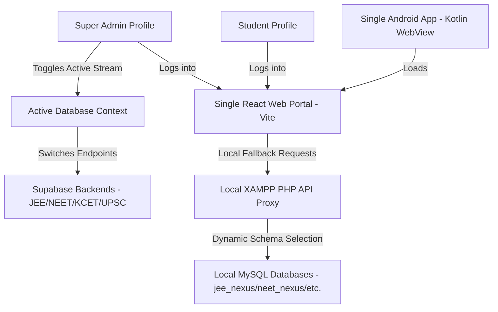

# Project Brain - Core Architecture & System Overview

This folder (`brain/`) serves as the central memory bank for the multi-stream exam portal. Any AI assistant working on this project must read the files in this folder first to establish complete context.

---

## 1. Project Context
*   **Goal**: Premium mock testing system for four main streams: **JEE**, **NEET**, **KCET**, and **UPSC**.
*   **Core Principle**: A single login page, single Super Admin dashboard (with database switching capabilities), and a single Android app, while keeping SQLite question banks organized in subfolders (`jee/DB/`, `neet/DB/`, `kcet/DB/`, `upsc/DB/`).

---

## 2. System Architecture



---

## 3. Persistent Files Inventory

*   [PROJECT_BRAIN.md](file:///d:/JEE/brain/PROJECT_BRAIN.md): General overview, architecture diagrams, and system configurations.
*   [session_history.md](file:///d:/JEE/brain/session_history.md): Session-by-session diaries, work records, and design decisions.
*   [next_steps.md](file:///d:/JEE/brain/next_steps.md): Pending items, future plans, and upcoming features.

---

## 4. Run & Test Instructions

### React Web Client
```bash
npm install
npm run dev     # Dev server launches on Port 3000
npm run build   # Build production bundle
```

### Local API
Ensure XAMPP is running Apache on localhost. The PHP files in `api/` will handle local requests.
