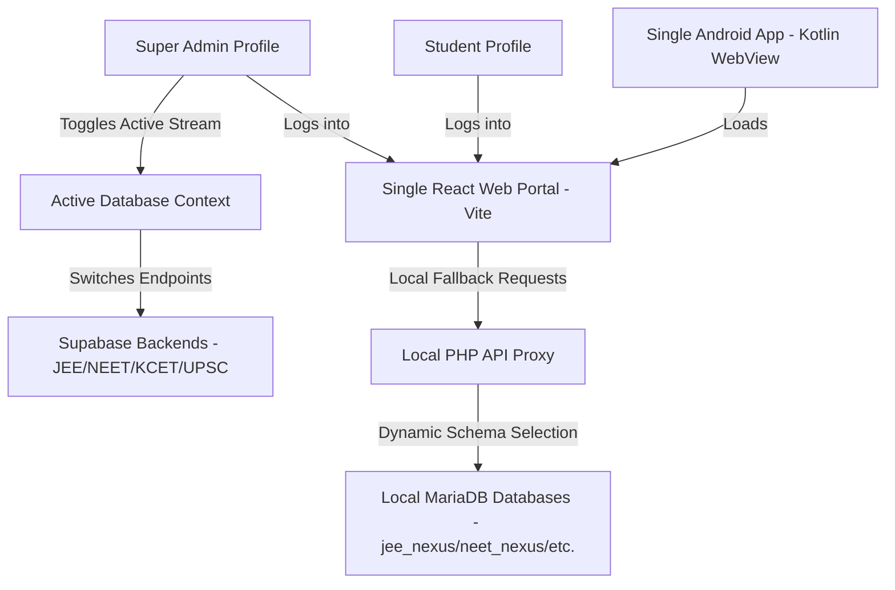

# Project Brain - Core Architecture & System Overview

This folder (`brain/`) serves as the central memory bank for the multi-stream exam portal. Any AI assistant working on this project must read the files in this folder first to establish complete context.

---

## 1. Project Context
*   **Goal**: Premium mock testing system for four main streams: **JEE**, **NEET**, **KCET**, and **UPSC**.
*   **Core Principle**: A single login page, single Super Admin dashboard (with database switching capabilities), and a single Android app, while keeping SQLite question banks organized in subfolders (`jee/DB/`, `neet/DB/`, `kcet/DB/`, `upsc/DB/`).

---

## 2. System Architecture


```mermaid
graph TD
    A[Single Android App - Kotlin WebView] -->|Loads | B[Single React Web Portal - Vite]
    C[Student Profile] -->|Logs into| B
    D[Super Admin Profile] -->|Logs into| B
    D -->|Toggles Active Stream| E[Active Database Context]
    E -->|Switches Endpoints| F[Supabase Backends - JEE/NEET/KCET/UPSC]
    B -->|Local Fallback Requests| G[Local PHP API Proxy]
    G -->|Dynamic Schema Selection| H[Local MariaDB Databases - jee_nexus/neet_nexus/etc.]
```

---

## 3. Persistent Files Inventory

*   [PROJECT_BRAIN.md](file:///d:/JEE/brain/PROJECT_BRAIN.md): General overview, architecture diagrams, and system configurations.
*   [session_history.md](file:///d:/JEE/brain/session_history.md): Session-by-session diaries, work records, and design decisions.
*   [next_steps.md](file:///d:/JEE/brain/next_steps.md): Pending items, future plans, and upcoming features.
*   [make_repos_private.js](file:///d:/JEE/scripts/make_repos_private.js): Utility script to bulk convert owned GitHub repositories from public to private.

---

## 4. Run & Test Instructions

### React Web Client
```bash
npm install
npm run dev     # Dev server launches on Port 3000
npm run build   # Build production bundle
```

### Local API Backend
Ensure the MariaDB and PHP built-in servers are running. They are registered as persistent background Windows Scheduled Tasks (`MariaDBServer` and `PHPServer`) running under the `SYSTEM` account, launching automatically at system startup and listening on Port 80.

---

## 5. Revenue & Micro-Payments Tracking Design
*   **Micro-Unlock Price**: Student micro-payment mock-unlocks cost ₹10.
*   **Immediate Draft Registration**: When a student completes Razorpay checkout, the client immediately calls `createDraftPaidAttempt()` (or `submitDailyAttempt()`) to write a draft/initial record (with `paid: true` in its config) to the database. This records the revenue instantly even if the student closes the browser tab before completing the mock test.
*   **Upsert on Completion**: Switched mock attempt saving to use Supabase `upsert` keyed by the draft's unique ID. When the student clicks submit, the draft record is overwritten with final exam scores, preventing duplicate revenue logging.
*   **Schema Fallback Protection**: In cases where schema sync is pending and the `paid` column is missing from `exam_attempts` (throwing pg errors), `getActualTotalRevenue()` falls back to client-side parsing of the `config` JSONB column (`config.paid === true`) to calculate the actual platform revenue accurately.

---

## 6. NEET UG Stream Details
*   **Subjects**: Structured into Physics, Chemistry, Botany, and Zoology.
*   **Dynamic Credentials**: Integrates with the distinct NEET Supabase database (`https://pasyqykxlskcrvtqboxd.supabase.co`) using a Proxy switcher context that activates when the user selects the NEET stream.
*   **Question Type**: NEET relies strictly on MCQs (+4/-1 marking scheme). All numerical entry inputs are bypassed, and question engines (both AI and deterministic fallbacks) are isolated from JEE/math-based elements.

---

## 7. GitHub Repository Visibility Utility
*   **Script Location**: [make_repos_private.js](file:///d:/JEE/scripts/make_repos_private.js)
*   **Purpose**: Bulk updates visibility of all public repositories owned by the user to private.
*   **Authentication**: Reads the `GITHUB_PAT` token from the `.env` file (stored locally and gitignored) or accepts it as a command line argument.

---

## 8. Question Deduplication & Database Integrity
*   **Hash Deduplication Strategy**: To prevent repeating questions in a single exam or across practice sessions, client-side filtering utilizes [questionTracker.ts](file:///d:/JEE/src/utils/questionTracker.ts) which computes question hashes strictly based on normalized question statement text. This guarantees identical question statements are deduplicated, even if they have different database primary IDs.
*   **Database Cleanup**: Periodically run paginated scan and delete routines to remove physical duplicate entries. In July 2026, 312 duplicates were cleaned from the NEET database. The Main database has Row-Level Security (RLS) enabled on the `questions` table which blocks anonymous deletions. However, duplicate questions are 100% cleanly filtered out client-side during tests and practice sessions by [questionTracker.ts](file:///d:/JEE/src/utils/questionTracker.ts).
*   **Real-Time Seeding via Gemini**: The Supabase seeder (`seedMassiveQuestionsToDB`) has been updated to strictly query the Gemini API in real-time. It enforces official pattern distributions (20 MCQs and 10 Numericals per subject for JEE, and 45 MCQs per subject for NEET) and guarantees equal distribution across all subjects.
*   **Server Key Distribution & Sequential Single-Question Seeding**: Question generation runs sequentially (one question at a time) using a round-robin rotation across all Gemini API keys stored in user profiles on the server, avoiding rate limits and output token truncation errors. Seeding is fully manual and triggers only when the super admin clicks the seeding button.
*   **Rate-Limit Preserving Seeding**: Calculated dynamic delay intervals between sequential question generations based on the total number of active API keys configured (4.2 seconds for 1 key, 2.2 seconds for 2 keys, and 1.5 seconds for 3+ keys). This preserves Gemini's 15 RPM (requests per minute) limit per key and completely avoids Too Many Requests (429) rate limit errors during bulk database seeding.
*   **Daily Practice Generation Limit (5 questions per user/day)**: Enforces a strict practice generation limit of 5 questions per user per day for students and normal admins to conserve API keys and quotas. Super admins are exempted from this practicing constraint to allow admin-triggered database seeding.
*   **NVIDIA NIM API Key Support**: Supports NVIDIA API keys (keys containing `nvapi-` or `AO_`). When an NVIDIA key is configured, the application automatically routes chat and question generation requests to the NVIDIA NIM completions endpoint (`https://integrate.api.nvidia.com/v1/chat/completions`). Both Google Gemini and NVIDIA API keys are fully supported in parallel.
*   **Multiple Model Support (Gemma 4 & GLM 5.2)**: Built a dynamic AI Model Selector in the settings dashboard allowing users to select between Google Gemini (Default), NVIDIA Gemma 4 (31B), and NVIDIA GLM 5.2. When GLM 5.2 is selected, custom parameters (`temperature = 1`, `top_p = 1`, `seed = 42`, and `clear_thinking = false` under `chat_template_kwargs`) are automatically configured to enable reasoning output.
*   **Same-Origin Proxy Bypass for NVIDIA NIM**: Configured a same-origin proxy path (`/nvidia-api`) to transparently forward chat completions to NVIDIA's server. Implemented via Vite's `server.proxy` object for local development, and Netlify's `_redirects` configuration in production. This completely eliminates CORS preflight issues and third-party proxy requirements/blocks.
*   **Fast API Verification & Generation Override**: Forcefully redirects verification check calls to run on a fast, non-thinking model (`google/gemma-4-31b-it`) with a limited token count (100) and `enable_thinking: false`. Similarly, general question generation calls via NVIDIA NIM have `enable_thinking: false` and `max_tokens` capped at `4096`. This guarantees all NVIDIA queries return in under 2 seconds, staying safely below Netlify's 10-second gateway timeout limit on verification, seeding, and practice generation.
*   **Exponential Retry Backoff for NVIDIA NIM**: Added a 5-attempt retry loop with exponential sleep backoff (up to 20s for the fifth attempt) on `429 Too Many Requests` rate-limit errors in `callNvidiaAPI`. This shields the generation flows from failing when rate limits are temporarily exceeded.
*   **Prioritize Database Fetching in Exams and Practice**: Optimized [ExamSetup.tsx](file:///d:/JEE/src/pages/ExamSetup.tsx) and [Practice.tsx](file:///d:/JEE/src/pages/Practice.tsx) to query the Database Question Bank first. The system only triggers AI question generation if the database has insufficient questions for the requested subjects, chapters, or difficulty levels. This eliminates the "Initializing..." hangs, saves API key quotas, and prevents 429 rate limit errors when starting exams.
*   **Bulk Database Seeding Script**: Created a standalone node script [bulk_seed_questions.js](file:///d:/JEE/scripts/bulk_seed_questions.js) to query and upload questions from the local SQLite database (`jee/DB/questions.db`) and local JSON pool (`officialJeeExtractedPapers.json`). It extracts over 16,188 high-difficulty past JEE questions matching official subjects, chapters, and formats (MCQs and Numericals), dedupes them by normalized text content, and uploads them in batches of 500 directly to Supabase.
*   **Local CLI Question Generator Utility**: Implemented a standalone command-line Node.js script [local_question_generator.js](file:///d:/JEE/scripts/local_question_generator.js). This script runs locally in the terminal using configured `.env` credentials, generating structured LaTeX questions sequentially in the background. It appends generated items to a local file (`local_generated_questions.json`) to act as a secure persistent data cache, and includes an option to batch-upload questions to Supabase on demand.
*   **Automated Question Database Sync**: Integrated database saving directly into all four stream question generation wrappers (`geminiService.ts`, `neetGeminiService.ts`, `kcetGeminiService.ts`, and `upscGeminiService.ts`). Every time a user generates questions using their API credentials, they are formatted, deduped on statement content, and automatically saved back to the database for future practice.

---

## 9. Current Operational State

The platform is configured to run in a hybrid **Cloudfront/Local Server Mode** permanently.
*   **PHP & MariaDB Hosting**: Fully hosted on this local server PC. PHP 8.3 and MariaDB Server are configured as Windows Scheduled Tasks (`MariaDBServer` and `PHPServer`) running under the `SYSTEM` account, serving the API on Port 80 and launching on system startup.
*   **Database Directory**: MariaDB data directory (`datadir`) is relocated to `d:/JEE/DB`. All user profiles, log-in credentials, subscription plans, and exam states are stored inside the `d:\JEE\DB` folder.
*   **Cloudflare Tunnel**: Cloudflare Tunnel is running 24/7 on the local PC via the `CloudflareTunnel` Windows Scheduled Task. It starts the tunnel at system boot using `scripts/run_tunnel.ps1`, parses the dynamic public HTTPS URL of the tunnel, and publishes it automatically to `backend_url.txt` in the GitHub repository.
*   **Routing proxy**: Supabase library (`@supabase/supabase-js`) is completely removed. All query and auth calls are intercepted inside `src/supabase.ts` and `Login.tsx` and dynamically routed to the active public tunnel URL fetched at runtime from GitHub. This links the Netlify production website directly to this local PC backend 24/7.
*   **Production Environment**: Pushed `netlify.toml` which forces Netlify builds to use `VITE_USE_LOCAL_SERVER = true` and `VITE_API_URL = http://localhost/api`, meaning that in both local and remote deployments, the database points to the local MariaDB server running on the student's/admin's local machine.
