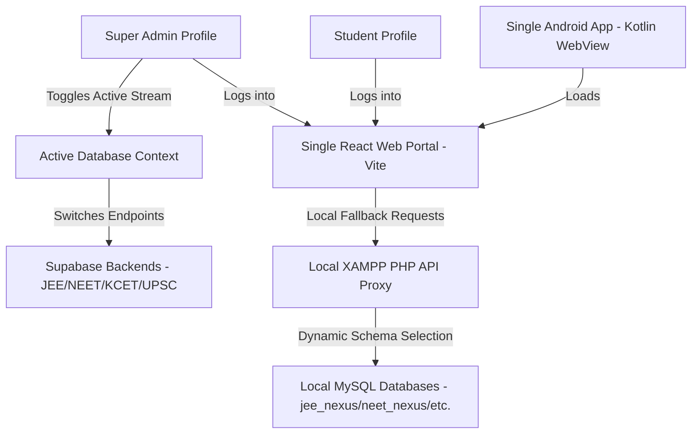

# Project Brain - Core Architecture & System Overview

This folder (`brain/`) serves as the central memory bank for the multi-stream exam portal. Any AI assistant working on this project must read the files in this folder first to establish complete context.

---

## 1. Project Context
*   **Goal**: Premium mock testing system for four main streams: **JEE**, **NEET**, **KCET**, and **UPSC**.
*   **Core Principle**: A single login page, single Super Admin dashboard (with database switching capabilities), and a single Android app, while keeping SQLite question banks organized in subfolders (`jee/DB/`, `neet/DB/`, `kcet/DB/`, `upsc/DB/`).

---

## 2. System Architecture


```mermaid
graph TD
    A[Single Android App - Kotlin WebView] -->|Loads | B[Single React Web Portal - Vite]
    C[Student Profile] -->|Logs into| B
    D[Super Admin Profile] -->|Logs into| B
    D -->|Toggles Active Stream| E[Active Database Context]
    E -->|Switches Endpoints| F[Supabase Backends - JEE/NEET/KCET/UPSC]
    B -->|Local Fallback Requests| G[Local XAMPP PHP API Proxy]
    G -->|Dynamic Schema Selection| H[Local MySQL Databases - jee_nexus/neet_nexus/etc.]
```

---

## 3. Persistent Files Inventory

*   [PROJECT_BRAIN.md](file:///d:/JEE/brain/PROJECT_BRAIN.md): General overview, architecture diagrams, and system configurations.
*   [session_history.md](file:///d:/JEE/brain/session_history.md): Session-by-session diaries, work records, and design decisions.
*   [next_steps.md](file:///d:/JEE/brain/next_steps.md): Pending items, future plans, and upcoming features.
*   [make_repos_private.js](file:///d:/JEE/scripts/make_repos_private.js): Utility script to bulk convert owned GitHub repositories from public to private.

---

## 4. Run & Test Instructions

### React Web Client
```bash
npm install
npm run dev     # Dev server launches on Port 3000
npm run build   # Build production bundle
```

### Local API
Ensure XAMPP is running Apache on localhost. The PHP files in `api/` will handle local requests.

---

## 5. Revenue & Micro-Payments Tracking Design
*   **Micro-Unlock Price**: Student micro-payment mock-unlocks cost ₹10.
*   **Immediate Draft Registration**: When a student completes Razorpay checkout, the client immediately calls `createDraftPaidAttempt()` (or `submitDailyAttempt()`) to write a draft/initial record (with `paid: true` in its config) to the database. This records the revenue instantly even if the student closes the browser tab before completing the mock test.
*   **Upsert on Completion**: Switched mock attempt saving to use Supabase `upsert` keyed by the draft's unique ID. When the student clicks submit, the draft record is overwritten with final exam scores, preventing duplicate revenue logging.
*   **Schema Fallback Protection**: In cases where schema sync is pending and the `paid` column is missing from `exam_attempts` (throwing pg errors), `getActualTotalRevenue()` falls back to client-side parsing of the `config` JSONB column (`config.paid === true`) to calculate the actual platform revenue accurately.

---

## 6. NEET UG Stream Details
*   **Subjects**: Structured into Physics, Chemistry, Botany, and Zoology.
*   **Dynamic Credentials**: Integrates with the distinct NEET Supabase database (`https://pasyqykxlskcrvtqboxd.supabase.co`) using a Proxy switcher context that activates when the user selects the NEET stream.
*   **Question Type**: NEET relies strictly on MCQs (+4/-1 marking scheme). All numerical entry inputs are bypassed, and question engines (both AI and deterministic fallbacks) are fully isolated from JEE/math-based elements.

---

## 7. GitHub Repository Visibility Utility
*   **Script Location**: [make_repos_private.js](file:///d:/JEE/scripts/make_repos_private.js)
*   **Purpose**: Bulk updates visibility of all public repositories owned by the user to private.
*   **Authentication**: Reads the `GITHUB_PAT` token from the `.env` file (stored locally and gitignored) or accepts it as a command line argument.

---

## 8. Question Deduplication & Database Integrity
*   **Hash Deduplication Strategy**: To prevent repeating questions in a single exam or across practice sessions, client-side filtering utilizes [questionTracker.ts](file:///d:/JEE/src/utils/questionTracker.ts) which computes question hashes strictly based on normalized question statement text. This guarantees identical question statements are deduplicated, even if they have different database primary IDs.
*   **Database Cleanup**: Periodically run paginated scan and delete routines to remove physical duplicate entries. In July 2026, 312 duplicates were cleaned from the NEET database. The Main database has Row-Level Security (RLS) enabled on the `questions` table which blocks anonymous deletions. However, duplicate questions are 100% cleanly filtered out client-side during tests and practice sessions by [questionTracker.ts](file:///d:/JEE/src/utils/questionTracker.ts).
*   **Real-Time Seeding via Gemini**: The Supabase seeder (`seedMassiveQuestionsToDB`) has been updated to strictly query the Gemini API in real-time. It enforces official pattern distributions (20 MCQs and 10 Numericals per subject for JEE, and 45 MCQs per subject for NEET) and guarantees equal distribution across all subjects.
*   **Server Key Distribution & Sequential Single-Question Seeding**: Question generation runs sequentially (one question at a time) using a round-robin rotation across all Gemini API keys stored in user profiles on the server, avoiding rate limits and output token truncation errors. Additionally, a background daily seeder (`runAutomaticDailyQuestionSeeding`) automatically triggers when the Super Admin panel mounts to seed up to 100 questions per day.
*   **Daily Practice Generation Limit (5 questions per user/day)**: Enforces a strict practice generation limit of 5 questions per user per day for students and normal admins to conserve API keys and quotas. Super admins are exempted from this practicing constraint to allow admin-triggered database seeding.
*   **NVIDIA NIM API Key Support**: Supports NVIDIA API keys (keys containing `nvapi-` or `AO_`). When an NVIDIA key is configured, the application automatically routes chat and question generation requests to the NVIDIA NIM completions endpoint (`https://integrate.api.nvidia.com/v1/chat/completions`). Both Google Gemini and NVIDIA API keys are fully supported in parallel.
*   **Multiple Model Support (Gemma 4 & GLM 5.2)**: Built a dynamic AI Model Selector in the settings dashboard allowing users to select between Google Gemini (Default), NVIDIA Gemma 4 (31B), and NVIDIA GLM 5.2. When GLM 5.2 is selected, custom parameters (`temperature = 1`, `top_p = 1`, `seed = 42`, and `clear_thinking = false` under `chat_template_kwargs`) are automatically configured to enable reasoning output.
*   **Same-Origin Proxy Bypass for NVIDIA NIM**: Configured a same-origin proxy path (`/nvidia-api`) to transparently forward chat completions to NVIDIA's server. Implemented via Vite's `server.proxy` object for local development, and Netlify's `_redirects` configuration in production. This completely eliminates CORS preflight issues and third-party proxy requirements/blocks.
*   **Fast API Verification Override**: Forcefully redirects verification check calls to run on a fast, non-thinking model (`google/gemma-4-31b-it`) with a limited token count (100) and `enable_thinking: false`. This guarantees verification queries return in under 500ms, staying safely below Netlify's 10-second gateway timeout limit.
*   **Automated Question Database Sync**: Integrated database saving directly into all four stream question generation wrappers (`geminiService.ts`, `neetGeminiService.ts`, `kcetGeminiService.ts`, and `upscGeminiService.ts`). Every time a user generates questions using their API credentials, they are formatted, deduped on statement content, and automatically saved back to the database for future practice.


